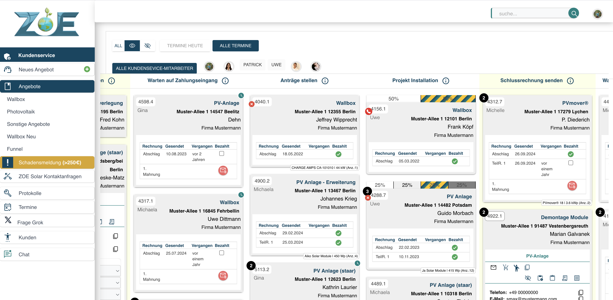

# FaPro

**Status**: Active  
**Symfony Version**: 7.4  
**PHP**: >= 8.2

  
*Komplexe Software mit dynamischer Fragen/Antworten Angebotserstellung inkl. Produkt-Auswahl und Rechnungsautomatisierung*

## Überblick

FaPro ist ein integriertes ERP/CRM-System für ein Unternehmen im Bereich erneuerbare Energien. Das System verwaltet Kunden, Angebote, Produkte, Rechnungen, Zeiterfassung und Termine.

## Technologie-Stack

| Komponente | Technologie |
|------------|-------------|
| Backend | Symfony 7.4, PHP 8.2+ |
| Database | Doctrine ORM (MySQL/PostgreSQL) |
| Frontend | Bootstrap 5, jQuery, Stimulus |
| Build | Webpack Encore |
| Auth | JWT (web-token/jwt-framework) + Symfony Security |
| API | REST + External Integrations |

## Hauptfunktionen

- **Kundenverwaltung**: Kunden, Ansprechpartner, Notizen
- **Angebotswesen**: Automatisierte Angebote, Kategorien, Fragen, Antworten
- **Produktkatalog**: Produkte, Unterkategorien, Hersteller
- **Rechnungsstellung**: Teilrechnungen, Rechnungen, Mahnungen, Bestellungen (LexOffice-Integration)
- **Zeiterfassung**: Zeiterfassung pro Projekt/Kunde
- **Terminverwaltung**: Buchungen, Kalender-Integration (Google Calendar)
- **Dokumentenverwaltung**: PDFs, Bilder, Barcodes, QR-Codes
- **Benachrichtigungen**: Push-Notifications, E-Mail, Slack

## Security & Datenschutz-Aspekte

- JWT statt Sessions → stateless API
- Sensible Daten verschlüsselt (Secrets in Symfony secrets/)
- Doctrine Filter für Tenant-Sichtbarkeit (Multi-Company-fähig)
- Keine personenbezogenen Daten im Git

## Externe Integrationen

- **Google Calendar**: Terminsynchronisation
- **Google Cloud Speech**: Sprachverarbeitung
- **Slack**: Benachrichtigungen und Termin-Bots
- **LexOffice**: Buchhaltung und Rechnungsstellung
- **Firebase**: Push-Notifications

## Projektstruktur

```
src/
├── Controller/      # Symfony Controller (API + Web)
├── Entity/         # Doctrine Entities (ORM)
├── Service/        # Business Logic Services
├── Security/       # Auth & Security
├── Twig/           # Twig Extensions
├── Command/        # Console Commands
├── MessageHandler/ # Symfony Messenger Handler
├── Factory/        # Doctrine Factories
├── Filter/         # Doctrine Filters
├── EventListener/  # Doctrine Event Listeners
└── Enum/           # PHP Enums

config/
├── packages/       # Symfony Konfiguration (multi-environment)
├── secrets/        # Secrets (nicht in Git!)
└── routes/         # Routing
```

## Installation

```bash
# PHP-Dependencies installieren
composer install

# Environment-Variablen einrichten
cp .env .env.local

# Datenbank einrichten
php bin/console doctrine:database:create
php bin/console doctrine:migrations:migrate

# Assets bauen
npm install
npm run build

# Dev-Server starten
symfony server:start
```

## Verfügbare Commands

```bash
# VAPID-Keys für Push-Notifications generieren
php bin/console app:generate:vapid-keys

# Slack-Termin-Bot
php bin/console app:slack:appointment
```

## Multi-Environment

Das Projekt unterstützt mehrere Konfigurationsumgebungen für Subdomains:

- `software/` - Standard-Software-Konfiguration
- `bw/` - Baden-Württemberg Variante
- `holzarbeit/` - Holzarbeit-Variante

Umschalten über Service-YAMLs in `config/packages/`.

## Coding-Standards

- PHPStan Level: max
- PHP CS Fixer
- Rector für automatische Upgrades

## Entwicklung

```bash
# Code-Qualität prüfen
composer phpstan
composer cs-fixer

# Tests ausführen
php bin/phpunit

# Auto-Fixes
vendor/bin/rector process
```

## Lizenz

Dieses Projekt ist unter der MIT-Lizenz lizenziert - Details entnehmen Sie der [LICENSE](LICENSE) Datei.

Copyright (c) 2025 Simone Schulze
